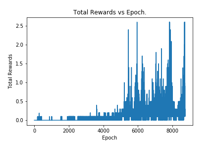

# Report 

### Learning Algorithm

For this Project I used the a Multi-Agent Deep Deterministic Policy Gradient (e.g. DDPG) which is well suited for reinforcement learning problems in continuous spaces. DDPG is an pseudo-actor critic model that differs from your standard actor critic model in that the critic is used to approximate the maximizer over the Q values for the next state instead of a learned baseline. The actor approximates the optimal policy deterministically, which is then maximized by the critic. For network arctitecture, a simple target network was used to prevent the model from chasing "moving target" values, and an experience replay that was sampled randomly to further learn from previous action state combinations very similarly to the continuous control project. The neural networks themselves were rudimentary at best, they are 3 layer fully connected linear layers using rectified linear unit activation functions and batch normalization on the first layer of the network to minimize internal covariate shift. For hyperparameters I used the following:

| Name                     |  value                   |
:-------------------------:|:-------------------------:
 Buffer Size               |  1e4
 Batch Size                | 64
 Initial Epsilon           | 0.8
 Minimum Epsilon           | 0.1
 Epsilon Decay             | 1e-6
 Start Nosie               | 0.5
 Noise Decay               | None
 Epsilon Decay             | 1e-6
 max number of episodes    | 10000, actual: 8700
 Tau                       | 1e-3
 Gamma                     | 0.99
 actor learning rate       | e-4
 critic learning rate      | 1e-3
 number of network updates | 2 updates
 OU Noise mu               | 0.0
 OU Noise theta            | 0.15
 OU Noise theta            | 0.1

###  Plot of Rewards

### Ideas for future work

I have a few interests as far as future work goes. First, I would like to try adding adaptive noise to the parameter space as opposed to the action space, I've  that **make smarter** using parameter space noise as opposed to action space noise imporoves model performance and action space exploration. By injecting randomness directly into the parameters of the agent it alters the types of decisions it makes such that they always fully depend on what the agent currently senses. Since this method adds noise to the parameters of the policy, it makes an agent’s exploration consistent across different timesteps, whereas adding noise to the action space leads to more unpredictable exploration which isn’t correlated to anything unique to the agent’s parameters. The second future work I would like to go regarding this problem space is exporing the possibilities of using evolutionary strategies for solving the same problems. This interests me due to the compute resources required to train the reinforcement algorithms, as well as the fact that they are not easily scalable. [This open AI article](https://openai.com/blog/evolution-strategies/) proclaims to have cut down training time of policy based deep RL algorithms by 2 orders of magnitued by using evolutionary strategies and scaling up their computing resources. These evolutionary strategies tout the following No need for backprop, high parallelizability, a smaller set of hyperparameters to optimize, and "structured exploitation".

### (Optional) Challenge: Crawler Environment

After you have successfully completed the project, you might like to solve the more difficult **Soccer** environment.

![Soccer][image2]

In this environment, the goal is to train a team of agents to play soccer.  

You can read more about this environment in the ML-Agents GitHub [here](https://github.com/Unity-Technologies/ml-agents/blob/master/docs/Learning-Environment-Examples.md#soccer-twos).  To solve this harder task, you'll need to download a new Unity environment.  (**Note**: Udacity students should not submit a project with this new environment.)

You need only select the environment that matches your operating system:
- Linux: [click here](https://s3-us-west-1.amazonaws.com/udacity-drlnd/P3/Soccer/Soccer_Linux.zip)
- Mac OSX: [click here](https://s3-us-west-1.amazonaws.com/udacity-drlnd/P3/Soccer/Soccer.app.zip)
- Windows (32-bit): [click here](https://s3-us-west-1.amazonaws.com/udacity-drlnd/P3/Soccer/Soccer_Windows_x86.zip)
- Windows (64-bit): [click here](https://s3-us-west-1.amazonaws.com/udacity-drlnd/P3/Soccer/Soccer_Windows_x86_64.zip)

Then, place the file in the `p3_collab-compet/` folder in the DRLND GitHub repository, and unzip (or decompress) the file.  Next, open `Soccer.ipynb` and follow the instructions to learn how to use the Python API to control the agent.

(_For AWS_) If you'd like to train the agents on AWS (and have not [enabled a virtual screen](https://github.com/Unity-Technologies/ml-agents/blob/master/docs/Training-on-Amazon-Web-Service.md)), then please use [this link](https://s3-us-west-1.amazonaws.com/udacity-drlnd/P3/Soccer/Soccer_Linux_NoVis.zip) to obtain the "headless" version of the environment.  You will **not** be able to watch the agents without enabling a virtual screen, but you will be able to train the agents.  (_To watch the agents, you should follow the instructions to [enable a virtual screen](https://github.com/Unity-Technologies/ml-agents/blob/master/docs/Training-on-Amazon-Web-Service.md), and then download the environment for the **Linux** operating system above._)

